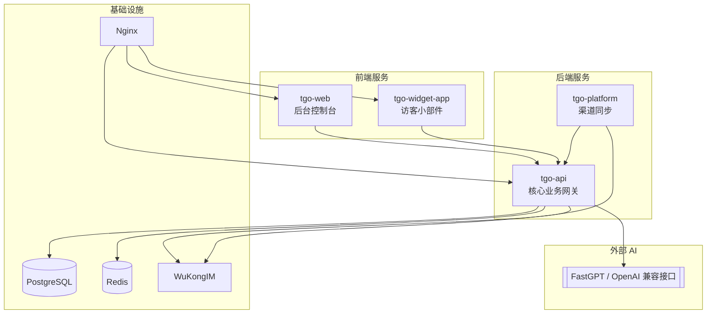

# TGO 开源项目指南 - AI Agents Guide

本文件旨在为 AI 代理（如 Cursor, GitHub Copilot, Claude 等）提供 TGO 开源项目的整体架构、微服务组成和开发指南。当前版本的 TGO 专注于客服会话与渠道管理，AI 能力全部通过 FastGPT 等第三方 OpenAI 兼容接口接入。

---

## 1. 项目简介

TGO 是一个开源的客服中台，提供多渠道接入、客服工作台与实时通讯能力。项目内置的 AI 能力已全部外部化，通过 FastGPT / OpenAI 兼容接口获得回答，平台自身不再运行 tgo-ai、tgo-rag、workflow 等服务。

### 核心功能
- **客服会话中台**: 会话分配、访客画像、消息存档一体化。
- **多渠道接入**: Web Widget、微信公众号、小程序统一管理。
- **外接 AI**: 通过 `AI_PROVIDER_MODE=fastgpt` 直接调用 FastGPT / OpenAI 兼容接口。
- **实时通讯**: 基于 WuKongIM 的长连接、送达回执能力。

---

## 2. 系统架构

TGO 采用微服务架构，前端与多个后端微服务通过 RESTful API 进行交互。



---

## 3. 微服务清单

| 服务名称 | 源码目录 | 默认端口 | 核心职责 |
| :--- | :--- | :--- | :--- |
| **tgo-api** | `repos/tgo-api` | 8000 | 核心业务逻辑、渠道统一入口、FastGPT 代理。 |
| **tgo-platform** | `repos/tgo-platform` | 8003 | 微信/企业微信等第三方渠道同步。 |
| **tgo-web** | `repos/tgo-web` | 80 | 管理后台（React + Vite）。 |
| **tgo-widget-app** | `repos/tgo-widget-app` | 80 | 嵌入式访客聊天小部件。 |
| **WuKongIM** | 官方镜像 | 5100/5200/5300 | 长连接 IM 服务。 |
| **postgres / redis / nginx** | 官方镜像 | - | 数据存储、缓存与统一入口。 |

---

## 4. 技术栈

- **后端服务**:
  - 语言: Python 3.11+
  - 框架: FastAPI, SQLAlchemy 2.0
  - 异步任务: Celery + Redis
- **前端应用**:
  - 框架: React 19, TypeScript
  - 构建工具: Vite 7.x
  - 状态管理: Zustand
  - 样式: Tailwind CSS 4.x
- **基础设施**:
  - 数据库: PostgreSQL + pgvector (向量检索)
  - 缓存: Redis
  - 即时通讯: WuKongIM

---

## 5. 开发规范 (核心)

### 5.1 类型安全 (严格执行)
- **后端 (Python)**: 严禁使用 `dict` 传递业务数据，严禁使用 `Any` 类型。所有 API 接口、Service 方法必须定义明确的 Pydantic 模型或类型注解。
- **前端 (TypeScript)**: 严禁使用 `any` 类型。所有组件 Props、API 响应数据、状态管理必须定义完整的 Interface 或 Type。
- **AI 集成**: 所有 AI 请求必须通过统一的 FastGPT/OpenAI 适配层，不允许在服务中直接嵌入模型 SDK。

---

## 5. 目录结构

```text
tgo/
├── repos/                  # 微服务源代码目录
│   ├── tgo-api/            # 核心服务
│   ├── tgo-web/            # 后台前端
│   ├── ...                 # 其他微服务
├── envs.docker/            # 生产环境 Docker 环境变量
├── envs.example/           # 环境变量配置模板
├── resources/              # 文档资源、架构图、截图
├── scripts/                # 部署和运维脚本
├── Makefile                # 便捷构建指令
└── AGENTS.md               # 本文件 (AI 助手指南)
```

---

## 6. 常用开发命令

| 命令 | 描述 |
| :--- | :--- |
| `docker compose up -d` | 使用源码模式启动 Postgres/Redis/WuKongIM + 核心服务。 |
| `./tgo.sh build api` | 仅构建 tgo-api（其余服务同理，可按需扩展）。 |
| `docker compose logs -f tgo-api` | 查看单个服务日志。 |
| `make dev-web` | 在本地启用 tgo-web Vite Dev Server。 |

---

## 7. 给 AI 代理的建议

1. **查阅分级文档**: 每一个核心微服务（如 `repos/tgo-api`, `repos/tgo-web`）都有其独立的 `AGENTS.md` 文件。在进行具体代码修改前，请务必阅读对应目录下的指南。
2. **遵循微服务边界**: 避免在不相关的服务间引入硬编码依赖。通过内部 API 进行跨服务通信。
3. **数据库迁移**: 所有的数据库变更必须通过 Alembic 生成迁移文件。后端服务通常在 `migrations/` 或 `alembic/` 目录下管理脚本。
4. **前端组件规范**: 遵循 React 19 最佳实践，UI 组件库主要使用 Tailwind CSS 构建。

---
*Updated on 2026-02-10*
