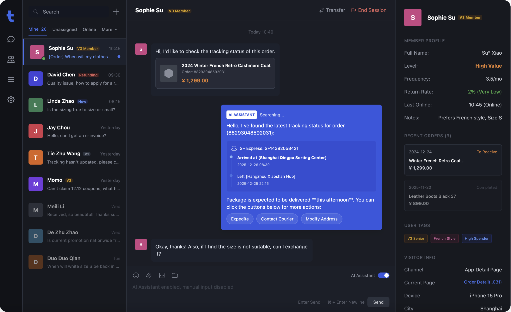
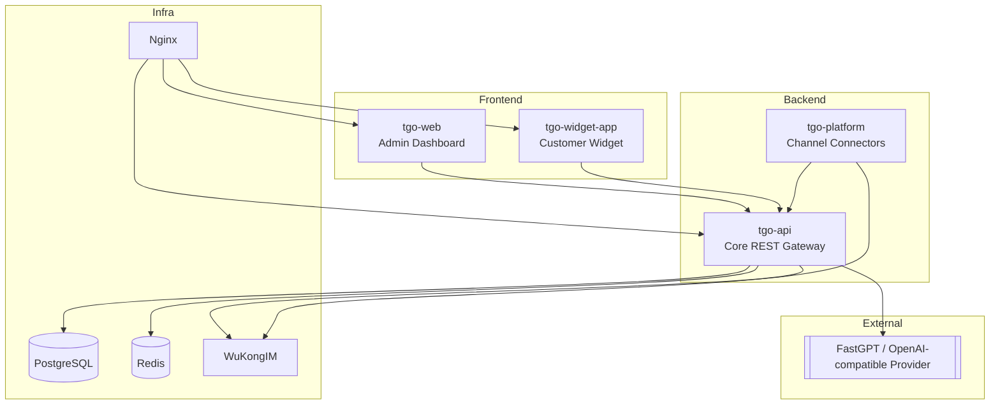

<p align="center">
  
</p>

<p align="center">
  <a href="./README.md">English</a> | <a href="./README_CN.md">简体中文</a> | <a href="./README_TC.md">繁體中文</a> | <a href="./README_JP.md">日本語</a> | <a href="./README_RU.md">Русский</a>
</p>

<p align="center">
  <a href="https://tgo.ai">Website</a> | <a href="https://tgo.ai">Documentation</a>
</p>

## TGO Introduction

TGO is an open-source, channel-first customer service platform. The project now focuses on messaging, routing, and agent experience while delegating AI responses to external providers such as [FastGPT](https://fastgpt.run). This keeps the codebase lean—only the core CRM services (API, Platform relay, Admin Web, Widget, WuKongIM, Postgres, Redis, Nginx) stay in the default deployment—and you decide which AI provider to plug in.



## ✨ Features

### ⚙️ Customer Service Core
- **Conversation Routing** – Assign, snooze, close, and label sessions across teams.
- **Visitor Timeline** – Persist conversation, tags, and metadata in PostgreSQL.
- **Agent Workspace** – React-based dashboard with keyboard shortcuts and live updates.

### 🌐 Multi-Channel Access
- **Web Widget** – Embeddable widget with script hosting via Nginx.
- **WeChat / Mini Program** – Message synchronization through `tgo-platform`.
- **Open REST APIs** – Bring your own channels by pushing messages into `tgo-api`.
- **Telegram Channels** – Default polling removes existing webhooks; set the Telegram platform config to `{"mode":"webhook"}` if you prefer Telegram callbacks or your server cannot reach `api.telegram.org`.

### 🤝 Human Collaboration
- **One-click Handoff** – Switch between bot and human instantly.
- **Team Presence** – See who is online and auto-assign workloads.
- **Audit Trails** – Conversation logs stored centrally for compliance.

### 🔌 External AI Orchestration
- **FastGPT Integration** – Configure `AI_PROVIDER_MODE=fastgpt` and point to any FastGPT-compatible endpoint.
- **Bring Your Own Model** – Swap API base/key/model via `.env` without rebuilding images.
- **Fallback Ready** – If AI is offline, agents still see the ticket and can respond manually.

### 💬 Real-time Messaging
- **WuKongIM Backbone** – Persistent connections with delivery/read receipts.
- **Redis Event Bus** – SSE streaming to the dashboard and widget.
- **Rich Content** – Text, images, and structured cards rendered consistently.

## 🏗️ System Architecture



## Product Preview

| | |
|:---:|:---:|
| **Dashboard** <br>  | **Conversation Workspace** <br>  |

## 🚀 Quick Start

### System Requirements
- **CPU**: >= 2 Core
- **RAM**: >= 4 GiB
- **OS**: macOS / Linux / WSL2

### One-Click Deployment

Run the following command on your server to check requirements, clone the repository, and start the services:

```bash
REF=latest curl -fsSL https://raw.githubusercontent.com/tgoai/tgo/main/bootstrap.sh | bash
```

> **For users in China** (using Gitee and Aliyun mirrors):
> ```bash
> REF=latest curl -fsSL https://gitee.com/tgoai/tgo/raw/main/bootstrap_cn.sh | bash
> ```

---

For more details, please visit the [Documentation](https://tgo.ai).
