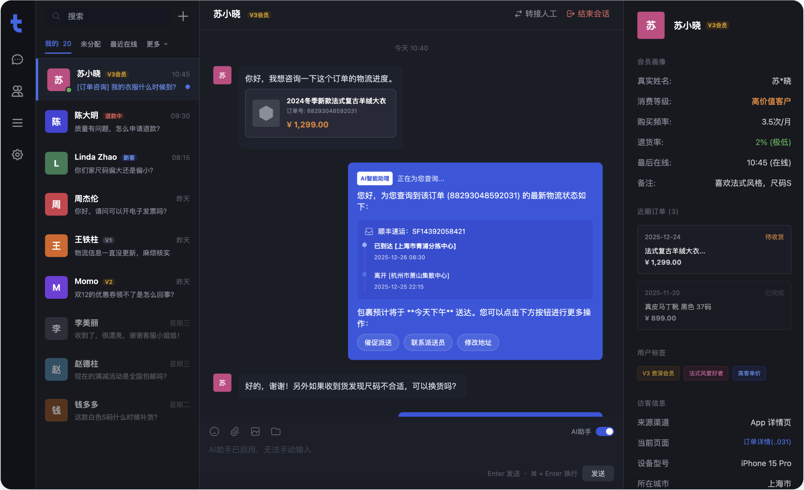
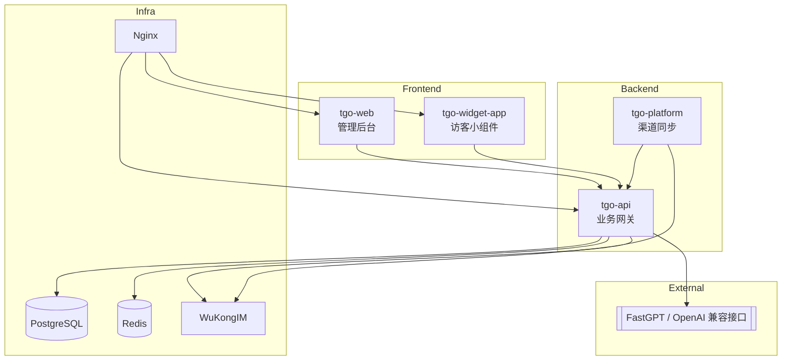
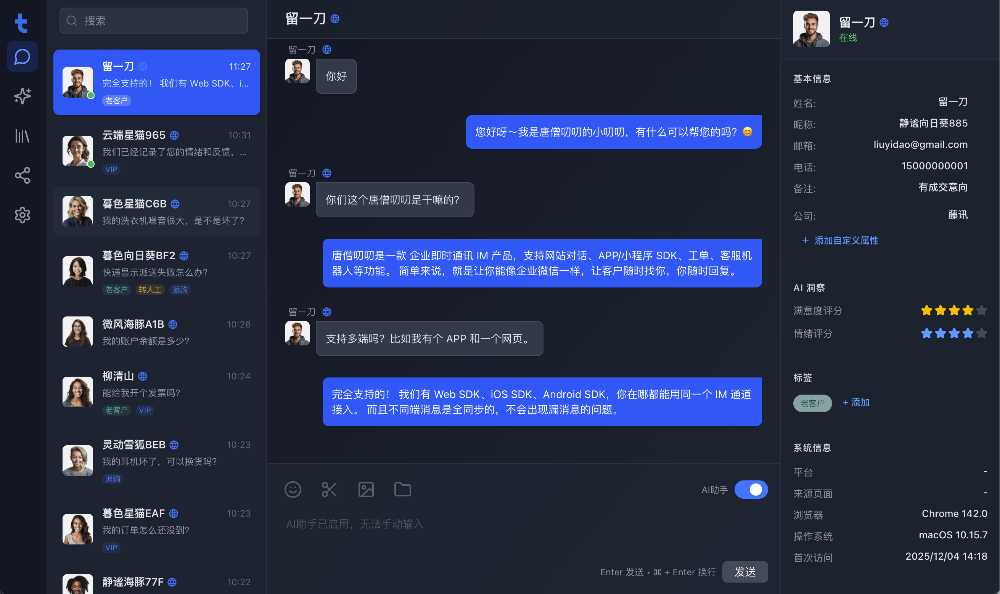
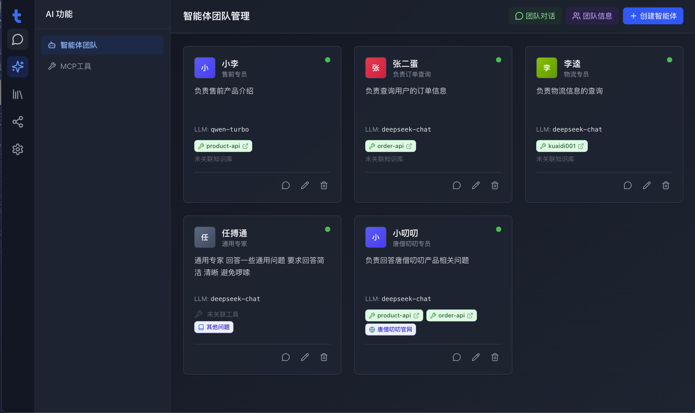

<p align="center">
  
</p>

<p align="center">
  <a href="./README.md">English</a> | <a href="./README_CN.md">简体中文</a>
</p>

## TGO 介绍

TGO 现在聚焦于“客服中台 + 外接 AI”模式：平台内置全渠道会话、客服工作台与悟空 IM 实时通讯，AI 能力统一转接到 [FastGPT](https://fastgpt.run) 等 OpenAI 兼容接口。默认 Docker Compose 仅包含 PostgreSQL、Redis、WuKongIM、tgo-api、tgo-platform、tgo-web、tgo-widget-app 与 Nginx，保持部署极简，而模型供应商由你决定。



## ✨ 核心特性

### ⚙️ 客服中台
- **会话路由**：按队列/技能组派单、暂停、关闭与标签管理。
- **访客时间线**：PostgreSQL 保存所有消息与上下文，方便追溯。
- **坐席工作台**：React + Vite 界面，快捷键、实时提示一应俱全。

### 🌐 多渠道接入
- **Web Widget**：可嵌入的访客小组件，脚本由 Nginx 统一托管。
- **微信/小程序**：通过 `tgo-platform` 同步消息、事件。
- **开放 API**：第三方渠道可直接写入 `tgo-api` 实现扩展。
- **Telegram**：默认轮询会删除 Bot webhook；如需使用官方回调或服务器无法访问 `api.telegram.org`，可在渠道配置中加入 `{"mode":"webhook"}` 关闭轮询。

### 🤝 人机协作
- **一键转人工**：Bot 与人工无缝切换。
- **团队在线状态**：查看在线坐席并自动分配工作量。
- **审计轨迹**：所有动作用统一格式记录，满足合规需求。

### 🔌 外接 AI
- **FastGPT 接入**：设置 `AI_PROVIDER_MODE=fastgpt` 后即可把请求转发到 FastGPT/OpenAI 兼容端点。
- **自定义模型**：通过 `.env` 调整 API Base / Key / Model，无需重新构建镜像。
- **可回退**：即便 AI 不可用，工单仍保留在工作台，可由人工回复。

### 💬 实时通讯
- **悟空 IM**：稳定的长连接、送达/已读回执。
- **Redis 事件流**：SSE 推送到后台和 Widget，消息实时同步。
- **富媒体**：文本、图片、结构化卡片统一渲染。

## 🏗️ 系统架构



## 产品预览

| | |
|:---:|:---:|
| **首页** <br>  | **会话工作台** <br>  |

## 🚀 快速开始

### 机器配置要求
- **CPU**: >= 2 Core
- **RAM**: >= 4 GiB
- **OS**: macOS / Linux / WSL2
- **Docker**: Docker + Docker Compose (plugin)

### 源码目录直接启动

```bash
git clone https://github.com/wzyonggege/tgoo.git
cd tgoo
cp .env.example .env
# 填写 FASTGPT_API_KEY 等关键配置
./tgo.sh install
./tgo.sh doctor
```

默认访问入口（按你的端口/域名调整）：
- 管理后台：`http://<host>/`
- API 文档：`http://<host>/api/v1/docs`
- Widget 示例：`http://<host>/widget/demo.html`

## 🔧 常见配置

### 1) 外接 AI（FastGPT/OpenAI 兼容）

`.env` 关键项：

```bash
AI_PROVIDER_MODE=fastgpt
FASTGPT_API_BASE=https://api.fastgpt.cloud
FASTGPT_API_KEY=your_key
FASTGPT_MODEL=gpt-4o-mini
FASTGPT_COMPLETIONS_PATH=/api/openapi/v1/chat/completions
```

### 2) 文件存储（本地 / MinIO / OSS / S3）

```bash
STORAGE_TYPE=local      # local | oss | minio | s3
```

- `oss`：配置 `OSS_*`
- `minio`：配置 `MINIO_*`
- `s3`：配置 `AWS_S3_*`

> 提示：`s3` 支持自定义 `AWS_S3_ENDPOINT_URL` 与 `AWS_S3_PUBLIC_BASE_URL`，可兼容多种 S3 协议存储。

## 🛠️ 运维命令速查

| 命令 | 说明 |
| :--- | :--- |
| `./tgo.sh install [--cn]` | 初始化并启动全套服务 |
| `./tgo.sh up [--cn]` | 启动服务（不重新初始化） |
| `./tgo.sh down [--volumes]` | 停止服务（可选删除卷） |
| `./tgo.sh doctor` | 健康检查 |
| `./tgo.sh build api/platform/web/widget/all` | 按服务重建镜像 |
| `./tgo.sh upgrade [--cn]` | 升级到最新版本 |
| `./tgo.sh config show` | 查看域名/SSL/白名单当前配置 |

## 🔐 域名、SSL 与白名单建议

- 使用内置配置命令管理入口：`./tgo.sh config ...`（会重生成 Nginx 配置）。
- 若服务器 80/443 已被占用，可先设置：
  - `./tgo.sh config http_port 8080`
  - `./tgo.sh config https_port 8443`
- 如果你使用外部 Nginx/网关统一接管证书，建议将 TGO 内部设为 `ssl_mode none`，由外层反代 `/`、`/api`、`/widget`、WebSocket 到 TGO。
- IP 白名单优先放在最外层网关统一控制；若用 `./tgo.sh config ip_allow ...`，请确认反向代理链路不会绕过该层 Nginx。
