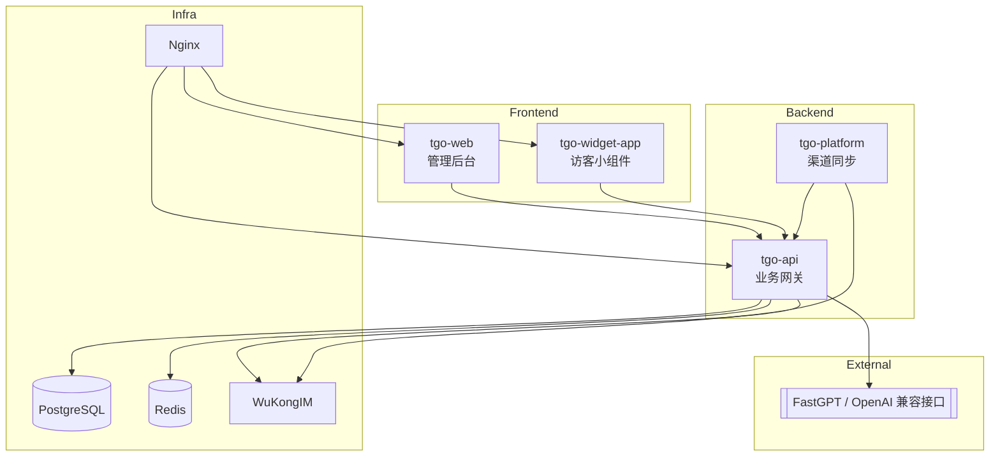

<p align="center">
  
</p>

<p align="center">
  <a href="./README.md">English</a> | <a href="./README_CN.md">简体中文</a> | <a href="./README_TC.md">繁體中文</a> | <a href="./README_JP.md">日本語</a> | <a href="./README_RU.md">Русский</a>
</p>

<p align="center">
  <a href="https://tgo.ai">官网</a> | <a href="https://tgo.ai">文档</a>
</p>

## TGO 介绍

TGO 现在聚焦于“客服中台 + 外接 AI”模式：平台内置全渠道会话、客服工作台与悟空 IM 实时通讯，AI 能力统一转接到 [FastGPT](https://fastgpt.run) 等 OpenAI 兼容接口。默认 Docker Compose 仅包含 PostgreSQL、Redis、WuKongIM、tgo-api、tgo-platform、tgo-web、tgo-widget-app 与 Nginx，保持部署极简，而模型供应商由你决定。


## ✨ 核心特性

### ⚙️ 客服中台
- **会话路由**：按队列/技能组派单、暂停、关闭与标签管理。
- **访客时间线**：PostgreSQL 保存所有消息与上下文，方便追溯。
- **坐席工作台**：React + Vite 界面，快捷键、实时提示一应俱全。

### 🌐 多渠道接入
- **Web Widget**：可嵌入的访客小组件，脚本由 Nginx 统一托管。
- **微信/小程序**：通过 `tgo-platform` 同步消息、事件。
- **开放 API**：第三方渠道可直接写入 `tgo-api` 实现扩展。
- **Telegram**：默认轮询会删除 Bot webhook；如需使用官方回调或服务器无法访问 `api.telegram.org`，可在渠道配置中加入 `{"mode":"webhook"}` 关闭轮询。

### 🤝 人机协作
- **一键转人工**：Bot 与人工无缝切换。
- **团队在线状态**：查看在线坐席并自动分配工作量。
- **审计轨迹**：所有动作用统一格式记录，满足合规需求。

### 🔌 外接 AI
- **FastGPT 接入**：设置 `AI_PROVIDER_MODE=fastgpt` 后即可把请求转发到 FastGPT/OpenAI 兼容端点。
- **自定义模型**：通过 `.env` 调整 API Base / Key / Model，无需重新构建镜像。
- **可回退**：即便 AI 不可用，工单仍保留在工作台，可由人工回复。

### 💬 实时通讯
- **悟空 IM**：稳定的长连接、送达/已读回执。
- **Redis 事件流**：SSE 推送到后台和 Widget，消息实时同步。
- **富媒体**：文本、图片、结构化卡片统一渲染。

## 🏗️ 系统架构



## 产品预览

| | |
|:---:|:---:|
| **首页** <br>  | **会话工作台** <br>  |

## 🚀 快速开始 (Quick Start)

### 机器配置要求
- **CPU**: >= 2 Core
- **RAM**: >= 4 GiB
- **OS**: macOS / Linux / WSL2

### 一键部署

在服务器上运行以下命令即可完成检查、克隆并启动服务：

```bash
REF=latest curl -fsSL https://raw.githubusercontent.com/tgoai/tgo/main/bootstrap.sh | bash
```

> **中国境内用户推荐使用国内加速版**（使用 Gitee 和阿里云镜像）：
> ```bash
> REF=latest curl -fsSL https://gitee.com/tgoai/tgo/raw/main/bootstrap_cn.sh | bash
> ```

---

更多详细信息请参阅 [文档](https://tgo.ai)。
