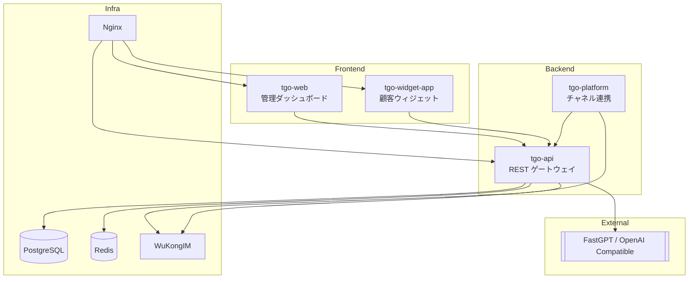

<p align="center">
  
</p>

<p align="center">
  <a href="./README.md">English</a> | <a href="./README_CN.md">简体中文</a> | <a href="./README_TC.md">繁體中文</a> | <a href="./README_JP.md">日本語</a> | <a href="./README_RU.md">Русский</a>
</p>

<p align="center">
  <a href="https://tgo.ai">公式サイト</a> | <a href="https://tgo.ai">ドキュメント</a>
</p>

## TGO 紹介

TGO は「チャネルファーストのカスタマーサポート基盤 + 外部AI」という構成に刷新されました。会話ルーティング、エージェント UI、WuKongIM をプロジェクト内で提供し、AI 応答は [FastGPT](https://fastgpt.run) など OpenAI 互換エンドポイントに委譲します。標準の Docker Compose には PostgreSQL / Redis / WuKongIM / tgo-api / tgo-platform / tgo-web / tgo-widget-app / Nginx のみを含み、どの AI プロバイダを使うかは `.env` の設定で切り替えます。


## ✨ 主な機能

### ⚙️ カスタマーサポート基盤
- **会話ルーティング**：キュー / スキルに基づく割り当て、保留、クローズ、タグ付け。
- **訪問者タイムライン**：全メッセージを PostgreSQL に保存し、検索・監査に利用。
- **エージェントワークスペース**：React + Vite 製 UI、ショートカットとライブ更新を提供。

### 🌐 マルチチャネル
- **Web ウィジェット**：Nginx から配信される埋め込みチャット。
- **WeChat / Mini Program**：`tgo-platform` がイベントを同期。
- **オープン API**：独自チャネルを `tgo-api` に接続して会話を投入可能。
- **Telegram**：既定では polling のため既存 Webhook を削除します。Webhook 連携を維持したい／サーバーから `api.telegram.org` に出られない場合はプラットフォーム設定へ `{"mode":"webhook"}` を追加してください。

### 🤝 人とAIの協働
- **ワンクリックハンドオフ**：Bot から人間への切り替えが即座。
- **チームプレゼンス**：オンライン状況とワークロードを可視化し、自動配分。
- **監査ログ**：すべての操作を統一フォーマットで保存。

### 🔌 外部AI連携
- **FastGPT 統合**：`AI_PROVIDER_MODE=fastgpt` で FastGPT/OpenAI 互換 API に転送。
- **Bring-your-own-model**：`.env` で API Base/Key/Model を変更するだけで切り替え。
- **フェイルセーフ**：AI が落ちてもチケットはワークスペースに残り、人間が対応可能。

### 💬 リアルタイム通信
- **WuKongIM**：永続的な接続と既読/配信ステータス。
- **Redis イベントバス**：SSE でダッシュボードとウィジェットに即時配信。
- **リッチカード**：テキスト・画像・構造化カードを統一レンダリング。

## 🏗️ システムアーキテクチャ



## 製品プレビュー

| | |
|:---:|:---:|
| **ダッシュボード** <br>  | **会話ワークスペース** <br>  |

## 🚀 クイックスタート (Quick Start)

### システム要件
- **CPU**: >= 2 Core
- **RAM**: >= 4 GiB
- **OS**: macOS / Linux / WSL2

### ワンクリックデプロイ

以下のコマンドをサーバーで実行して、要件を確認し、リポジトリをクローンして、サービスを開始します。

```bash
REF=latest curl -fsSL https://raw.githubusercontent.com/tgoai/tgo/main/bootstrap.sh | bash
```

---

詳細については、[ドキュメント](https://tgo.ai)をご覧ください。
