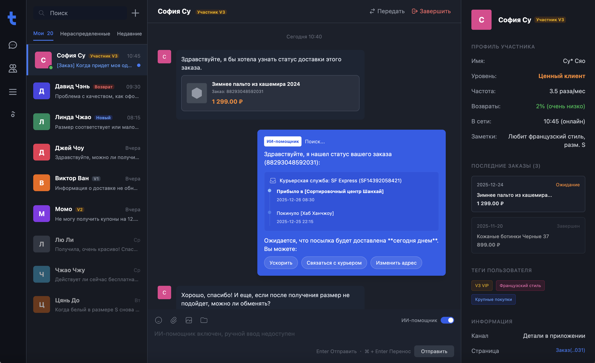
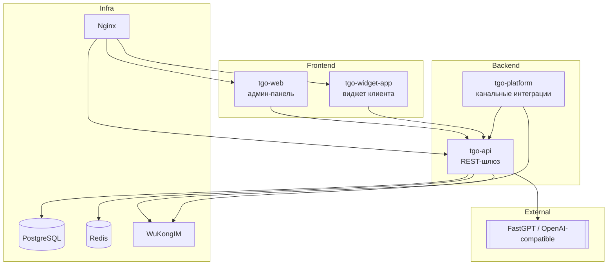
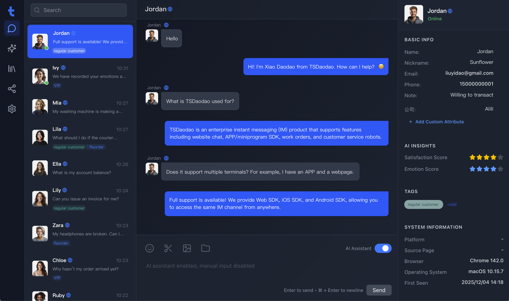
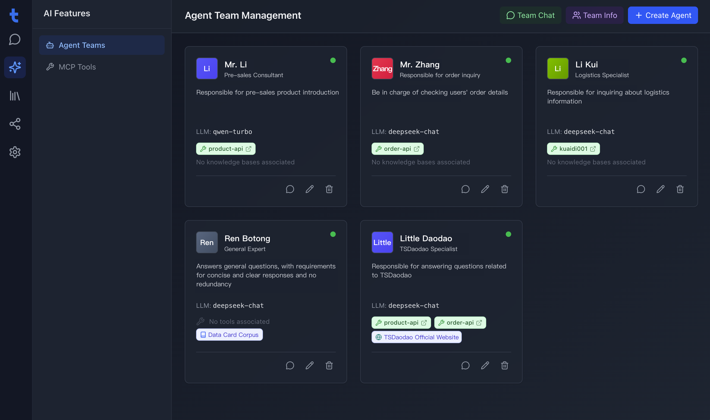

<p align="center">
  
</p>

<p align="center">
  <a href="./README.md">English</a> | <a href="./README_CN.md">简体中文</a> | <a href="./README_TC.md">繁體中文</a> | <a href="./README_JP.md">日本語</a> | <a href="./README_RU.md">Русский</a>
</p>

<p align="center">
  <a href="https://tgo.ai">Веб-сайт</a> | <a href="https://tgo.ai">Документация</a>
</p>

## Введение в TGO

TGO преобразован в «канало-ориентированную платформу поддержки + внешний ИИ». Платформа сама обеспечивает маршрутизацию диалогов, рабочее место операторов и мгновенные сообщения WuKongIM, а ответы ИИ делегируются внешним поставщикам вроде [FastGPT](https://fastgpt.run) (совместимым с OpenAI API). Базовый Docker Compose оставляет только необходимые сервисы: PostgreSQL, Redis, WuKongIM, tgo-api, tgo-platform, tgo-web, tgo-widget-app и Nginx; выбор конкретной модели задаётся через переменные окружения.



## ✨ Основные возможности

### ⚙️ Ядро клиентской поддержки
- **Маршрутизация диалогов** — распределение, пауза, закрытие и тегирование обращений.
- **Таймлайн посетителя** — все сообщения хранятся в PostgreSQL для поиска и аудита.
- **Рабочее место оператора** — интерфейс на React + Vite с хоткеями и live-обновлениями.

### 🌐 Многоканальный доступ
- **Веб-виджет** — встраиваемый компонент, сценарий раздаётся через Nginx.
- **WeChat / Mini Program** — сервис `tgo-platform` синхронизирует события.
- **Открытые API** — можно подключить собственные каналы напрямую к `tgo-api`.
- **Telegram** — по умолчанию используется polling, который удаляет веб‑хуки. Если нужно оставить веб‑хуки или сервер не выходит в `api.telegram.org`, добавьте в конфиг платформы `{"mode":"webhook"}`.

### 🤝 Человек + ИИ
- **Мгновенная передача оператору** — переключение из бота в один клик.
- **Статус команды** — отображение онлайн-операторов и автораспределение нагрузки.
- **Аудит** — каждая операция фиксируется в едином формате.

### 🔌 Внешние AI-провайдеры
- **Интеграция FastGPT** — установите `AI_PROVIDER_MODE=fastgpt`, чтобы пересылать запросы в FastGPT/OpenAI-совместимые API.
- **Собственные модели** — меняйте API Base/Key/Model в `.env`, не пересобирая образы.
- **Режим fallback** — при недоступности ИИ обращение остаётся в очереди и обрабатывается человеком.

### 💬 Реальное время
- **WuKongIM** — постоянные подключения с подтверждением доставки/прочтения.
- **Redis Event Bus** — трансляция событий через SSE в админку и виджет.
- **Богатые карточки** — текст, изображения и структурированные данные отображаются одинаково.

## 🏗️ Архитектура системы



## Обзор продукта

| | |
|:---:|:---:|
| **Дашборд** <br>  | **Рабочее место диалога** <br>  |

## 🚀 Быстрый старт (Quick Start)

### Системные требования
- **CPU**: >= 2 Core
- **RAM**: >= 4 GiB
- **OS**: macOS / Linux / WSL2

### Развертывание в один клик

Выполните следующую команду на вашем сервере, чтобы проверить требования, клонировать репозиторий и запустить сервисы:

```bash
REF=latest curl -fsSL https://raw.githubusercontent.com/tgoai/tgo/main/bootstrap.sh | bash
```

---

Для получения дополнительной информации посетите [Документацию](https://tgo.ai).
