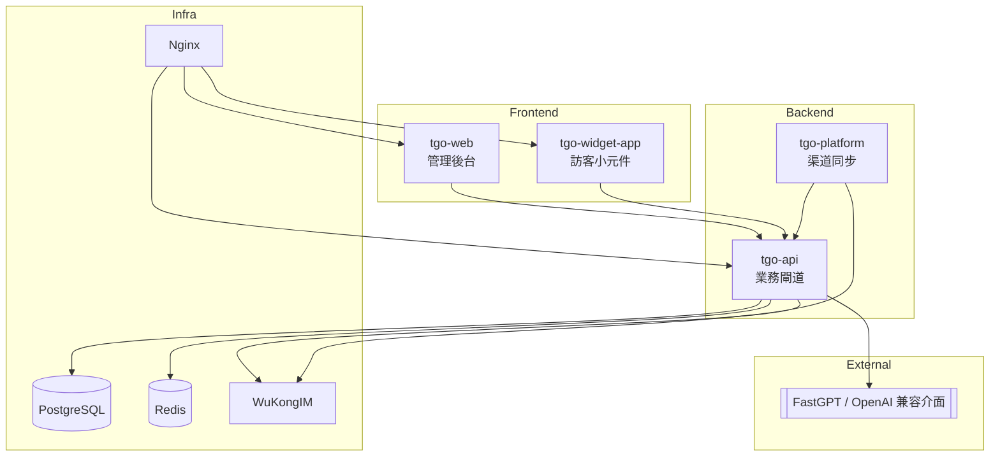

<p align="center">
  
</p>

<p align="center">
  <a href="./README.md">English</a> | <a href="./README_CN.md">简体中文</a> | <a href="./README_TC.md">繁體中文</a> | <a href="./README_JP.md">日本語</a> | <a href="./README_RU.md">Русский</a>
</p>

<p align="center">
  <a href="https://tgo.ai">官網</a> | <a href="https://tgo.ai">文檔</a>
</p>

## TGO 介紹

TGO 現在定位為「客服中台 + 外接 AI」：平台負責渠道打通、客服工作台與悟空 IM 即時通訊，AI 能力統一透過 [FastGPT](https://fastgpt.run) 等 OpenAI 兼容端點完成。預設的 Docker Compose 僅保留 PostgreSQL、Redis、WuKongIM、tgo-api、tgo-platform、tgo-web、tgo-widget-app 與 Nginx，部署更精簡，而模型供應商由你自訂。


## ✨ 核心特性

### ⚙️ 客服中台
- **會話路由**：依隊列/技能組派單、暫停、結案、加標籤。
- **訪客時間軸**：所有訊息寫入 PostgreSQL，方便稽核。
- **坐席工作台**：React + Vite 介面，含快捷鍵與即時提示。

### 🌐 多渠道接入
- **Web Widget**：可嵌入網站的小元件，由 Nginx 統一託管腳本。
- **微信 / 小程式**：`tgo-platform` 同步訊息與事件。
- **開放 API**：自有渠道可直接調用 `tgo-api` 送入會話。
- **Telegram**：預設輪詢會刪除 Bot webhook；若要使用官方回呼或伺服器無法連到 `api.telegram.org`，請在平台配置加入 `{"mode":"webhook"}` 停用輪詢。

### 🤝 人機協作
- **一鍵轉人工**：Bot 與人工無縫切換。
- **團隊在線狀態**：可視化坐席在線情況並自動分單。
- **稽核軌跡**：所有操作全量記錄，符合合規需求。

### 🔌 外接 AI
- **FastGPT 直連**：設為 `AI_PROVIDER_MODE=fastgpt` 後即可轉發至 FastGPT / OpenAI 兼容端點。
- **自訂模型**：透過 `.env` 改 API Base / Key / Model，無需重建鏡像。
- **故障回退**：AI 掛掉時，工單仍在工作台，坐席可立即接手。

### 💬 即時通訊
- **悟空 IM 主幹**：長連線 + 送達/已讀回執。
- **Redis 事件流**：SSE 推送至後台與 Widget，訊息零延遲。
- **豐富內容**：文字、圖片、結構化卡片一致渲染。

## 🏗️ 系統架構



## 產品預覽

| | |
|:---:|:---:|
| **首頁** <br>  | **會話工作台** <br>  |

## 🚀 快速開始 (Quick Start)

### 機器配置要求
- **CPU**: >= 2 Core
- **RAM**: >= 4 GiB
- **OS**: macOS / Linux / WSL2

### 一鍵部署

在服務器上運行以下命令即可完成檢查、克隆並啟動服務：

```bash
REF=latest curl -fsSL https://raw.githubusercontent.com/tgoai/tgo/main/bootstrap.sh | bash
```

> **中國境內用戶推薦使用國內加速版**（使用 Gitee 和阿里雲鏡像）：
> ```bash
> REF=latest curl -fsSL https://gitee.com/tgoai/tgo/raw/main/bootstrap_cn.sh | bash
> ```

---

更多詳細信息請參閱 [文檔](https://tgo.ai)。
